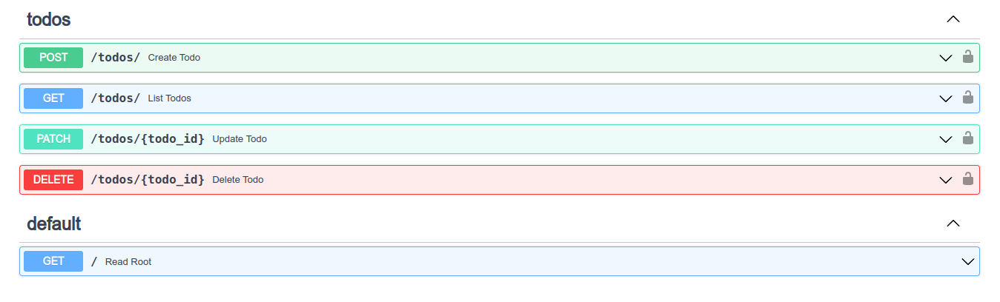
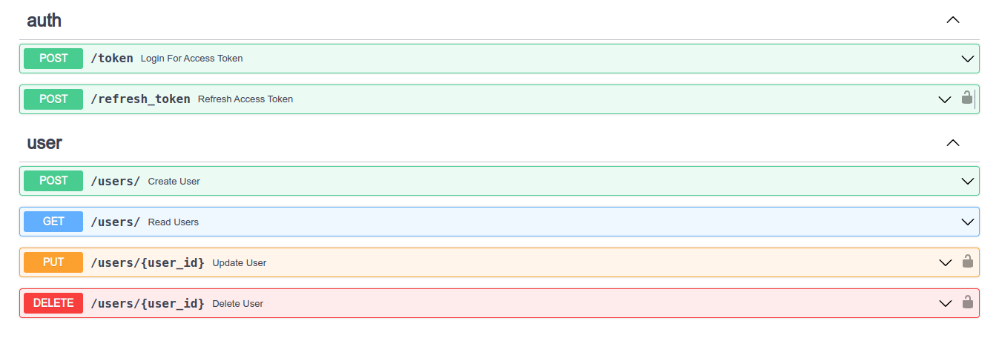
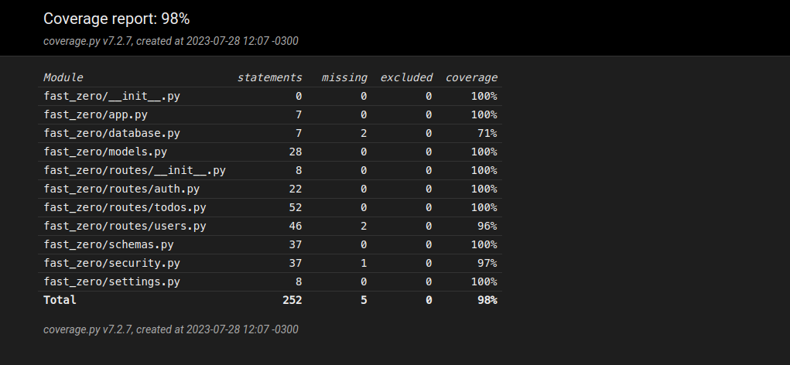

# FastZero

## ℹ️ Sobre o projeto 
Esse repositório é um repositório de acompanhamento ao curso FastAPI do Zero
do Eduardo Mendes, o objetivo é dominiar o framework Python FastAPI construindo 
um Projeto com Bancos de Dados, Testes e Deploy.

## Estrutura do Projeto
```
fast_zero
├── __init__.py
├── app.py
├── database.py
├── models.py
├── routes
│   ├── __init__.py
│   ├── auth.py
│   ├── todos.py
│   └── users.py
├── schemas.py
├── security.py
└── settings.py
```


## 💻 Tecnologias Usadas
- Poetry (gerenciador de pacotes)
- FastAPI (framework web)
- Pydantic (validator de dados)
- SQLAlchemy (ORM)
- Alembic (Migrations)
- Taskipy (automatização de comandos)
- Pytest (framework de tests)
- Ruff (linter)
- Blue (formatar de código)
- isort (ordenador de imports)

## SWAGGER UI



## Covarage Report



## Rodando o Projeto
Instalando dependências.

```
poetry install
```

Ativando o ambiente virtual

```
poetry shell
```

Rodando migrações

```
alembic upgrade head
```

Rodando a aplicação

```
task run
```


## 📎 Referências 
[FastAPI do ZERO](https://fastapidozero.dunossauro.com/01/) <br>
[Canal do Eduarno Mendes](https://www.youtube.com/@Dunossauro)
